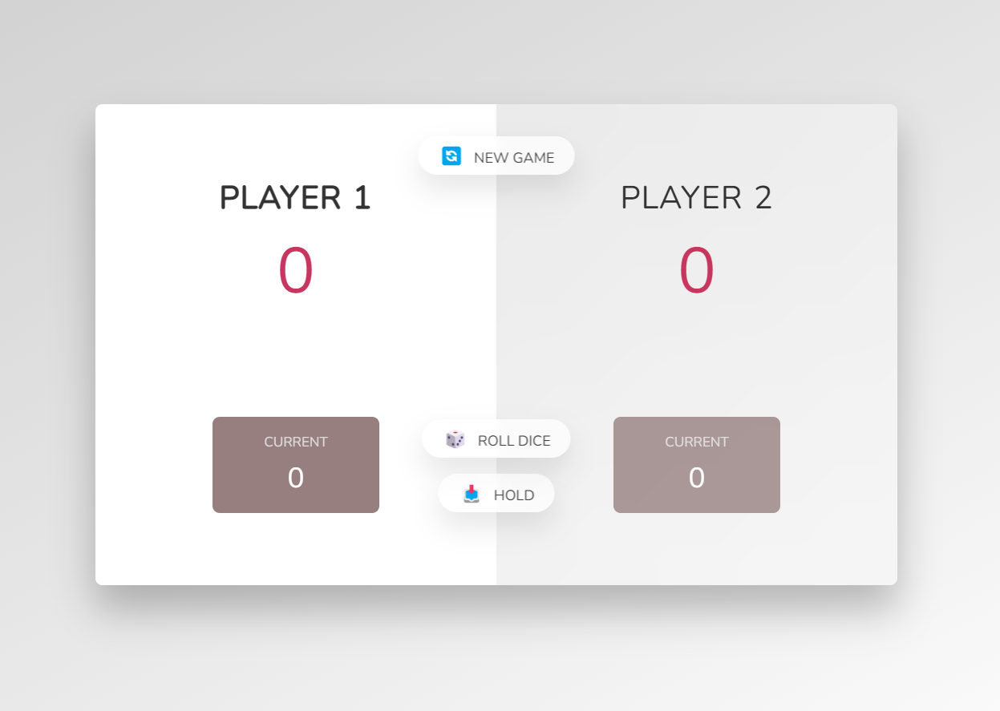

# Pig Game: Reach-30-First!

Save 30 points first to win the game!

## Description

* Player can click on 'Roll Dice' button to roll a dice 1 - 6. 
* Player's current point is saved every time dice is rolled unless player rolls 1.
* When player rolls 1, accumulated points are set to 0 and next player gets to roll the dice.
* Win the game by saving the points with 'Hold' button before current point resets/rolling 1! 
* First to reach 30 points in score wins!
* Click on 'New Game' button to start playing again.

## Getting Started

### Dependencies

* a web browser

### Installing

* No installation is necessary. Simply click on the link below to start playing!
[Pig Game](https://jyoungjoon.github.io/pig-game)

## Authors

Contributors names and contact info

Young Jang  
[@lif3scriptified](https://twitter.com/lif3scriptified)

Provider of Start Code: Jonas Schmedtmann
[@jonasschmedtman](https://twitter.com/jonasschmedtman)

## Version History

* 0.1
    * Initial Release

## License

This project is licensed under the [MIT] License - see the LICENSE.md file for details

## Acknowledgments

Inspiration, code snippets, etc.
* [awesome-readme](https://github.com/matiassingers/awesome-readme)
* [PurpleBooth](https://gist.github.com/PurpleBooth/109311bb0361f32d87a2)
* [dbader](https://github.com/dbader/readme-template)
* [zenorocha](https://gist.github.com/zenorocha/4526327)
* [fvcproductions](https://gist.github.com/fvcproductions/1bfc2d4aecb01a834b46)